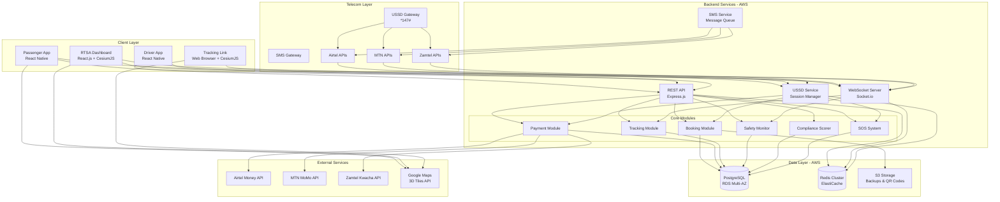

# Design Document: Twende Zambia Platform

## Overview

Twende Zambia is a comprehensive multi-platform transportation safety and booking system designed for the Zambian bus transport sector. The platform consists of mobile applications (passenger and driver), a web-based RTSA government dashboard, direct telecom operator integrations for USSD/SMS services, and backend services supporting real-time GPS tracking, booking management, mobile money payments, and safety monitoring.

### System Goals

- Enable passengers to book bus seats via mobile apps or USSD with mobile money payments
- Provide real-time 3D GPS tracking of buses using CesiumJS and Google Maps 3D Tiles API
- Monitor driver safety through speed detection, route deviation alerts, and SOS emergency systems
- Offer RTSA officials a comprehensive dashboard for fleet monitoring and compliance scoring
- Support offline GPS data buffering for areas with poor network connectivity
- Integrate directly with Zambian telecom operators (Airtel, MTN, Zamtel) for USSD and SMS services
- Ensure high availability, security, and regulatory compliance

### Key Architectural Decisions

1. **Monolithic Backend with Modular Design**: Single Node.js/Express application with clear module boundaries for easier deployment and maintenance in the Zambian context
2. **Direct Telecom Integration**: Direct API connections to Airtel, MTN, and Zamtel for USSD/SMS (no third-party aggregators)
3. **Real-Time Communication**: WebSocket-based architecture for GPS tracking and safety alerts
4. **Offline-First GPS Tracking**: Client-side buffering with automatic synchronization
5. **AWS Multi-AZ Deployment**: High availability across multiple availability zones
6. **PostgreSQL Primary Database**: Relational database for transactional data with Redis for caching and sessions
7. **CesiumJS 3D Rendering**: Browser-based 3D map visualization using Google Maps 3D Tiles API

## Architecture

### High-Level System Architecture



### Deployment Architecture

The system will be deployed on AWS with the following infrastructure:

- **Compute**: EC2 instances in Auto Scaling Groups across multiple availability zones
- **Load Balancing**: Application Load Balancer for HTTP/HTTPS traffic, Network Load Balancer for WebSocket connections
- **Database**: RDS PostgreSQL Multi-AZ deployment with read replicas
- **Cache**: ElastiCache Redis Cluster with automatic failover
- **Storage**: S3 for backups, QR codes, and static assets
- **Monitoring**: CloudWatch for metrics, logs, and alerting
- **CDN**: CloudFront for static asset delivery

### Technology Stack

**Backend**:

- Node.js 20 LTS
- Express.js 4.x (REST API)
- Socket.io 4.x (WebSocket server)
- PostgreSQL 15 (primary database)
- Redis 7.x (caching, sessions, rate limiting)
- Bull (job queue for async tasks)

**Mobile Apps**:

- React Native 0.73
- React Navigation 6.x
- React Native Maps (with Google Maps)
- Socket.io-client
- AsyncStorage (offline buffering)
- React Native Background Geolocation

**Web Dashboard**:

- React.js 18
- CesiumJS 1.112 (3D map rendering)
- Google Maps 3D Tiles API
- Socket.io-client
- Material-UI (component library)

**Telecom Integration**:

- Direct HTTP/HTTPS APIs to Airtel, MTN, Zamtel
- XML/JSON request/response formats (operator-specific)
- USSD session management with Redis

**Payment Integration**:

- Airtel Money API (REST)
- MTN MoMo API (REST)
- Zamtel Kwacha API (REST)

## Components and Interfaces

### 1. Booking Module

**Responsibilities**:

- Manage seat reservations and availability
- Handle booking lifecycle (create, confirm, cancel, modify)
- Generate QR codes for boarding
- Enforce business rules (reservation timeouts, cancellation policies)

**Key Interfaces**:

```typescript
interface BookingModule {
  // Create a new booking with seat reservation
  createBooking(params: CreateBookingParams): Promise<Booking>;

  // Confirm booking after successful payment
  confirmBooking(bookingId: string, paymentId: string): Promise<Booking>;

  // Cancel booking and process refund
  cancelBooking(bookingId: string, reason: string): Promise<RefundResult>;

  // Modify booking (seat change, date change)
  modifyBooking(bookingId: string, changes: BookingChanges): Promise<Booking>;

  // Get available seats for a journey
  getAvailableSeats(journeyId: string): Promise<Seat[]>;

  // Validate QR code and mark passenger as boarded
  validateQRCode(qrCode: string): Promise<BoardingResult>;

  // Release expired reservations (background job)
  releaseExpiredReservations(): Promise<number>;
}

interface CreateBookingParams {
  passengerId: string;
  journeyId: string;
  seatNumber: number;
  passengerName: string;
  passengerPhone: string;
  source: 'app' | 'ussd';
}

interface Booking {
  id: string;
  bookingReference: string;
  passengerId: string;
  journeyId: string;
  seatNumber: number;
  status: 'reserved' | 'confirmed' | 'cancelled' | 'completed';
  amount: number;
  qrCode: string;
  createdAt: Date;
  expiresAt: Date;
  confirmedAt?: Date;
}
```

### 2. Payment Module

**Responsibilities**:

- Integrate with mobile money providers (Airtel Money, MTN MoMo, Zamtel Kwacha)
- Process payments and refunds
- Handle payment callbacks and webhooks
- Maintain transaction records for reconciliation

**Key Interfaces**:

```typescript
interface PaymentModule {
  // Initiate payment with mobile money provider
  initiatePayment(params: PaymentParams): Promise<PaymentInitiation>;

  // Check payment status
  checkPaymentStatus(paymentId: string): Promise<PaymentStatus>;

  // Process refund
  processRefund(bookingId: string, amount: number, reason: string): Promise<Refund>;

  // Handle payment callback from provider
  handlePaymentCallback(provider: MobileMoneyProvider, payload: any): Promise<void>;

  // Reconcile transactions with provider statements
  reconcileTransactions(date: Date): Promise<ReconciliationReport>;
}

interface PaymentParams {
  bookingId: string;
  amount: number;
  phoneNumber: string;
  provider: MobileMoneyProvider;
  currency: 'ZMW';
}

type MobileMoneyProvider = 'airtel_money' | 'mtn_momo' | 'zamtel_kwacha';

interface PaymentInitiation {
  paymentId: string;
  status: 'pending' | 'initiated';
  transactionId: string; // Provider's transaction ID
  expiresAt: Date;
}

interface PaymentStatus {
  paymentId: string;
  status: 'pending' | 'success' | 'failed' | 'expired';
  transactionId: string;
  amount: number;
  completedAt?: Date;
  failureReason?: string;
}
```

### 3. Tracking Module

**Responsibilities**:

- Receive and store GPS data from drivers
- Broadcast real-time position updates via WebSocket
- Manage tracking link generation and access
- Handle offline GPS data buffering and synchronization

**Key Interfaces**:

```typescript
interface TrackingModule {
  // Receive GPS data from driver app
  receiveGPSData(data: GPSData): Promise<void>;

  // Receive buffered GPS data batch
  receiveBufferedGPSData(data: GPSData[]): Promise<void>;

  // Get current position for a journey
  getCurrentPosition(journeyId: string): Promise<GPSData | null>;

  // Generate shareable tracking link
  generateTrackingLink(journeyId: string, passengerId: string): Promise<TrackingLink>;

  // Validate tracking link access
  validateTrackingLink(token: string): Promise<TrackingLinkData>;

  // Broadcast position update to connected clients
  broadcastPosition(journeyId: string, position: GPSData): Promise<void>;
}

interface GPSData {
  journeyId: string;
  driverId: string;
  vehicleId: string;
  latitude: number;
  longitude: number;
  speed: number; // km/h
  heading: number; // degrees
  accuracy: number; // meters
  timestamp: Date;
  isBuffered: boolean;
}

interface TrackingLink {
  token: string;
  url: string;
  journeyId: string;
  expiresAt: Date;
}
```

### 4. Safety Monitor Module

**Responsibilities**:

- Detect speed violations based on route thresholds
- Detect route deviations from predefined paths
- Process and escalate safety alerts
- Update compliance scores based on violations

**Key Interfaces**:

```typescript
interface SafetyMonitor {
  // Check GPS data for safety violations
  checkSafetyViolations(gpsData: GPSData): Promise<SafetyViolation[]>;

  // Detect speed violations
  detectSpeedViolation(gpsData: GPSData, route: Route): Promise<SpeedViolation | null>;

  // Detect route deviations
  detectRouteDeviation(gpsData: GPSData, route: Route): Promise<RouteDeviation | null>;

  // Process safety alert and notify stakeholders
  processSafetyAlert(violation: SafetyViolation): Promise<void>;

  // Mark planned detour to suppress false alerts
  markPlannedDetour(journeyId: string, detour: DetourInfo): Promise<void>;
}

interface SafetyViolation {
  id: string;
  type: 'speed' | 'route_deviation';
  journeyId: string;
  driverId: string;
  vehicleId: string;
  operatorId: string;
  severity: 'low' | 'medium' | 'high';
  location: {
    latitude: number;
    longitude: number;
  };
  timestamp: Date;
  details: SpeedViolation | RouteDeviation;
}

interface SpeedViolation {
  actualSpeed: number;
  speedLimit: number;
  excessSpeed: number;
  routeSegment: string;
}

interface RouteDeviation {
  deviationDistance: number; // meters
  duration: number; // seconds
  isPlanned: boolean;
}
```

### 5. SOS System Module

**Responsibilities**:

- Process SOS alerts from passengers
- Notify emergency contacts, RTSA, and other passengers
- Track SOS resolution status
- Maintain continuous location tracking during SOS events

**Key Interfaces**:

```typescript
interface SOSSystem {
  // Trigger SOS alert
  triggerSOS(params: SOSParams): Promise<SOSAlert>;

  // Resolve SOS alert
  resolveSOSAlert(alertId: string, resolution: string): Promise<void>;

  // Get active SOS alerts for monitoring
  getActiveSOSAlerts(): Promise<SOSAlert[]>;

  // Cancel false alarm
  cancelFalseAlarm(alertId: string, passengerId: string): Promise<void>;
}

interface SOSParams {
  passengerId: string;
  journeyId: string;
  location: {
    latitude: number;
    longitude: number;
  };
  source: 'app' | 'ussd';
}

interface SOSAlert {
  id: string;
  passengerId: string;
  passengerName: string;
  passengerPhone: string;
  journeyId: string;
  location: {
    latitude: number;
    longitude: number;
  };
  status: 'active' | 'resolved' | 'false_alarm';
  triggeredAt: Date;
  resolvedAt?: Date;
  emergencyContacts: EmergencyContact[];
}
```

### 6. Compliance Scorer Module

**Responsibilities**:

- Calculate operator compliance scores (0-100)
- Update scores based on safety violations
- Increment scores for violation-free operation
- Flag operators for review or suspension

**Key Interfaces**:

```typescript
interface ComplianceScorer {
  // Calculate compliance score for an operator
  calculateComplianceScore(operatorId: string): Promise<number>;

  // Update score after safety violation
  deductPoints(operatorId: string, violation: SafetyViolation): Promise<number>;

  // Increment score for violation-free day
  incrementDailyScore(operatorId: string): Promise<number>;

  // Get compliance score history
  getScoreHistory(operatorId: string, period: DateRange): Promise<ScoreHistory[]>;

  // Get operators flagged for review
  getFlaggedOperators(): Promise<FlaggedOperator[]>;
}

interface ScoreHistory {
  date: Date;
  score: number;
  violations: number;
  violationTypes: string[];
}

interface FlaggedOperator {
  operatorId: string;
  operatorName: string;
  currentScore: number;
  flagReason: 'review' | 'suspension';
  violationCount: number;
  lastViolationDate: Date;
}
```

### 7. USSD Service Module

**Responsibilities**:

- Handle USSD session management across telecom operators
- Provide menu-driven booking interface
- Support SOS activation via USSD
- Manage multi-language support

**Key Interfaces**:

```typescript
interface USSDService {
  // Handle incoming USSD request
  handleUSSDRequest(request: USSDRequest): Promise<USSDResponse>;

  // Process menu selection
  processMenuSelection(sessionId: string, input: string): Promise<USSDResponse>;

  // Initiate booking flow
  startBookingFlow(sessionId: string, phoneNumber: string): Promise<USSDResponse>;

  // Initiate SOS flow
  startSOSFlow(sessionId: string, phoneNumber: string): Promise<USSDResponse>;

  // Get or create session
  getSession(sessionId: string): Promise<USSDSession>;

  // Update session state
  updateSession(sessionId: string, state: any): Promise<void>;
}

interface USSDRequest {
  sessionId: string;
  phoneNumber: string;
  input: string;
  operator: 'airtel' | 'mtn' | 'zamtel';
  isNewSession: boolean;
}

interface USSDResponse {
  message: string;
  continueSession: boolean;
  operator: 'airtel' | 'mtn' | 'zamtel';
}

interface USSDSession {
  sessionId: string;
  phoneNumber: string;
  operator: 'airtel' | 'mtn' | 'zamtel';
  language: 'en' | 'bem' | 'nya';
  state: {
    currentMenu: string;
    bookingData?: Partial<CreateBookingParams>;
    sosData?: Partial<SOSParams>;
  };
  createdAt: Date;
  lastActivityAt: Date;
  expiresAt: Date;
}
```

### 8. SMS Service Module

**Responsibilities**:

- Send SMS notifications via direct telecom operator APIs
- Queue messages for reliable delivery
- Track delivery status
- Support multi-language messages

**Key Interfaces**:

```typescript
interface SMSService {
  // Send SMS message
  sendSMS(params: SMSParams): Promise<SMSResult>;

  // Send bulk SMS messages
  sendBulkSMS(messages: SMSParams[]): Promise<SMSResult[]>;

  // Check delivery status
  checkDeliveryStatus(messageId: string): Promise<DeliveryStatus>;

  // Handle delivery report callback
  handleDeliveryReport(operator: string, payload: any): Promise<void>;
}

interface SMSParams {
  phoneNumber: string;
  message: string;
  operator?: 'airtel' | 'mtn' | 'zamtel'; // Auto-detect if not provided
  priority: 'high' | 'normal';
  language?: 'en' | 'bem' | 'nya';
}

interface SMSResult {
  messageId: string;
  status: 'queued' | 'sent' | 'failed';
  operator: 'airtel' | 'mtn' | 'zamtel';
  sentAt?: Date;
}
```

## Data Models

### Database Schema

The system uses PostgreSQL as the primary database with the following schema:

```sql
-- Users and Authentication
CREATE TABLE users (
  id UUID PRIMARY KEY DEFAULT gen_random_uuid(),
  phone_number VARCHAR(15) UNIQUE NOT NULL,
  name VARCHAR(255) NOT NULL,
  email VARCHAR(255),
  user_type VARCHAR(20) NOT NULL CHECK (user_type IN ('passenger', 'driver', 'operator', 'rtsa_official')),
  language VARCHAR(3) DEFAULT 'en' CHECK (language IN ('en', 'bem', 'nya')),
  created_at TIMESTAMP DEFAULT NOW(),
  updated_at TIMESTAMP DEFAULT NOW(),
  is_active BOOLEAN DEFAULT true
);

CREATE INDEX idx_users_phone ON users(phone_number);
CREATE INDEX idx_users_type ON users(user_type);

-- Emergency Contacts
CREATE TABLE emergency_contacts (
  id UUID PRIMARY KEY DEFAULT gen_random_uuid(),
  passenger_id UUID NOT NULL REFERENCES users(id) ON DELETE CASCADE,
  name VARCHAR(255) NOT NULL,
  phone_number VARCHAR(15) NOT NULL,
  is_verified BOOLEAN DEFAULT false,
  created_at TIMESTAMP DEFAULT NOW()
);

CREATE INDEX idx_emergency_contacts_passenger ON emergency_contacts(passenger_id);

-- Operators
CREATE TABLE operators (
  id UUID PRIMARY KEY DEFAULT gen_random_uuid(),
  name VARCHAR(255) NOT NULL,
  license_number VARCHAR(100) UNIQUE NOT NULL,
  contact_phone VARCHAR(15) NOT NULL,
  contact_email VARCHAR(255),
  compliance_score INTEGER DEFAULT 100 CHECK (compliance_score >= 0 AND compliance_score <= 100),
  is_active BOOLEAN DEFAULT true,
  created_at TIMESTAMP DEFAULT NOW(),
  updated_at TIMESTAMP DEFAULT NOW()
);

CREATE INDEX idx_operators_compliance ON operators(compliance_score);

-- Vehicles
CREATE TABLE vehicles (
  id UUID PRIMARY KEY DEFAULT gen_random_uuid(),
  operator_id UUID NOT NULL REFERENCES operators(id) ON DELETE CASCADE,
  registration_number VARCHAR(50) UNIQUE NOT NULL,
  capacity INTEGER NOT NULL CHECK (capacity > 0),
  vehicle_type VARCHAR(50) NOT NULL,
  is_wheelchair_accessible BOOLEAN DEFAULT false,
  is_active BOOLEAN DEFAULT true,
  under_maintenance BOOLEAN DEFAULT false,
  total_distance_km DECIMAL(10, 2) DEFAULT 0,
  journey_count INTEGER DEFAULT 0,
  created_at TIMESTAMP DEFAULT NOW(),
  updated_at TIMESTAMP DEFAULT NOW()
);

CREATE INDEX idx_vehicles_operator ON vehicles(operator_id);
CREATE INDEX idx_vehicles_registration ON vehicles(registration_number);

-- Drivers
CREATE TABLE drivers (
  id UUID PRIMARY KEY DEFAULT gen_random_uuid(),
  user_id UUID NOT NULL REFERENCES users(id) ON DELETE CASCADE,
  operator_id UUID NOT NULL REFERENCES operators(id) ON DELETE CASCADE,
  license_number VARCHAR(100) UNIQUE NOT NULL,
  performance_score INTEGER DEFAULT 100 CHECK (performance_score >= 0 AND performance_score <= 100),
  is_active BOOLEAN DEFAULT true,
  created_at TIMESTAMP DEFAULT NOW(),
  updated_at TIMESTAMP DEFAULT NOW()
);

CREATE INDEX idx_drivers_operator ON drivers(operator_id);
CREATE INDEX idx_drivers_user ON drivers(user_id);

-- Routes
CREATE TABLE routes (
  id UUID PRIMARY KEY DEFAULT gen_random_uuid(),
  operator_id UUID NOT NULL REFERENCES operators(id) ON DELETE CASCADE,
  name VARCHAR(255) NOT NULL,
  origin VARCHAR(255) NOT NULL,
  destination VARCHAR(255) NOT NULL,
  distance_km DECIMAL(10, 2) NOT NULL,
  route_type VARCHAR(20) NOT NULL CHECK (route_type IN ('urban', 'highway', 'mixed')),
  waypoints JSONB NOT NULL, -- Array of {lat, lng, name}
  speed_thresholds JSONB NOT NULL, -- Array of {segment, speed_limit}
  is_active BOOLEAN DEFAULT true,
  created_at TIMESTAMP DEFAULT NOW(),
  updated_at TIMESTAMP DEFAULT NOW()
);

CREATE INDEX idx_routes_operator ON routes(operator_id);
CREATE INDEX idx_routes_active ON routes(is_active);

-- Journeys
CREATE TABLE journeys (
  id UUID PRIMARY KEY DEFAULT gen_random_uuid(),
  route_id UUID NOT NULL REFERENCES routes(id) ON DELETE CASCADE,
  vehicle_id UUID NOT NULL REFERENCES vehicles(id) ON DELETE CASCADE,
  driver_id UUID NOT NULL REFERENCES drivers(id) ON DELETE CASCADE,
  scheduled_departure TIMESTAMP NOT NULL,
  scheduled_arrival TIMESTAMP NOT NULL,
  actual_departure TIMESTAMP,
  actual_arrival TIMESTAMP,
  base_price DECIMAL(10, 2) NOT NULL,
  current_price DECIMAL(10, 2) NOT NULL,
  status VARCHAR(20) NOT NULL DEFAULT 'scheduled' CHECK (status IN ('scheduled', 'active', 'completed', 'cancelled')),
  passenger_count INTEGER DEFAULT 0,
  created_at TIMESTAMP DEFAULT NOW(),
  updated_at TIMESTAMP DEFAULT NOW()
);

CREATE INDEX idx_journeys_route ON journeys(route_id);
CREATE INDEX idx_journeys_vehicle ON journeys(vehicle_id);
CREATE INDEX idx_journeys_driver ON journeys(driver_id);
CREATE INDEX idx_journeys_status ON journeys(status);
CREATE INDEX idx_journeys_scheduled_departure ON journeys(scheduled_departure);

-- Bookings
CREATE TABLE bookings (
  id UUID PRIMARY KEY DEFAULT gen_random_uuid(),
  booking_reference VARCHAR(20) UNIQUE NOT NULL,
  passenger_id UUID NOT NULL REFERENCES users(id) ON DELETE CASCADE,
  journey_id UUID NOT NULL REFERENCES journeys(id) ON DELETE CASCADE,
  seat_number INTEGER NOT NULL,
  passenger_name VARCHAR(255) NOT NULL,
  passenger_phone VARCHAR(15) NOT NULL,
  amount DECIMAL(10, 2) NOT NULL,
  status VARCHAR(20) NOT NULL DEFAULT 'reserved' CHECK (status IN ('reserved', 'confirmed', 'cancelled', 'completed')),
  qr_code TEXT,
  source VARCHAR(10) NOT NULL CHECK (source IN ('app', 'ussd')),
  is_boarded BOOLEAN DEFAULT false,
  boarded_at TIMESTAMP,
  created_at TIMESTAMP DEFAULT NOW(),
  expires_at TIMESTAMP,
  confirmed_at TIMESTAMP,
  cancelled_at TIMESTAMP,
  UNIQUE(journey_id, seat_number)
);

CREATE INDEX idx_bookings_passenger ON bookings(passenger_id);
CREATE INDEX idx_bookings_journey ON bookings(journey_id);
CREATE INDEX idx_bookings_reference ON bookings(booking_reference);
CREATE INDEX idx_bookings_status ON bookings(status);
CREATE INDEX idx_bookings_expires_at ON bookings(expires_at) WHERE status = 'reserved';

-- Payments
CREATE TABLE payments (
  id UUID PRIMARY KEY DEFAULT gen_random_uuid(),
  booking_id UUID NOT NULL REFERENCES bookings(id) ON DELETE CASCADE,
  amount DECIMAL(10, 2) NOT NULL,
  provider VARCHAR(20) NOT NULL CHECK (provider IN ('airtel_money', 'mtn_momo', 'zamtel_kwacha')),
  phone_number VARCHAR(15) NOT NULL,
  transaction_id VARCHAR(255),
  provider_transaction_id VARCHAR(255),
  status VARCHAR(20) NOT NULL DEFAULT 'pending' CHECK (status IN ('pending', 'initiated', 'success', 'failed', 'expired')),
  failure_reason TEXT,
  created_at TIMESTAMP DEFAULT NOW(),
  completed_at TIMESTAMP,
  expires_at TIMESTAMP
);

CREATE INDEX idx_payments_booking ON payments(booking_id);
CREATE INDEX idx_payments_status ON payments(status);
CREATE INDEX idx_payments_transaction_id ON payments(transaction_id);

-- Refunds
CREATE TABLE refunds (
  id UUID PRIMARY KEY DEFAULT gen_random_uuid(),
  booking_id UUID NOT NULL REFERENCES bookings(id) ON DELETE CASCADE,
  payment_id UUID NOT NULL REFERENCES payments(id) ON DELETE CASCADE,
  amount DECIMAL(10, 2) NOT NULL,
  cancellation_fee DECIMAL(10, 2) DEFAULT 0,
  net_refund DECIMAL(10, 2) NOT NULL,
  provider VARCHAR(20) NOT NULL,
  transaction_id VARCHAR(255),
  status VARCHAR(20) NOT NULL DEFAULT 'pending' CHECK (status IN ('pending', 'processing', 'completed', 'failed')),
  created_at TIMESTAMP DEFAULT NOW(),
  completed_at TIMESTAMP
);

CREATE INDEX idx_refunds_booking ON refunds(booking_id);
CREATE INDEX idx_refunds_status ON refunds(status);

-- GPS Tracking Data
CREATE TABLE gps_data (
  id BIGSERIAL PRIMARY KEY,
  journey_id UUID NOT NULL REFERENCES journeys(id) ON DELETE CASCADE,
  driver_id UUID NOT NULL REFERENCES drivers(id) ON DELETE CASCADE,
  vehicle_id UUID NOT NULL REFERENCES vehicles(id) ON DELETE CASCADE,
  latitude DECIMAL(10, 8) NOT NULL,
  longitude DECIMAL(11, 8) NOT NULL,
  speed DECIMAL(5, 2) NOT NULL,
  heading DECIMAL(5, 2) NOT NULL,
  accuracy DECIMAL(6, 2),
  is_buffered BOOLEAN DEFAULT false,
  timestamp TIMESTAMP NOT NULL,
  created_at TIMESTAMP DEFAULT NOW()
);

CREATE INDEX idx_gps_journey ON gps_data(journey_id, timestamp DESC);
CREATE INDEX idx_gps_timestamp ON gps_data(timestamp);
-- Partition by month for performance
CREATE INDEX idx_gps_created_at ON gps_data(created_at);

-- Safety Violations
CREATE TABLE safety_violations (
  id UUID PRIMARY KEY DEFAULT gen_random_uuid(),
  journey_id UUID NOT NULL REFERENCES journeys(id) ON DELETE CASCADE,
  driver_id UUID NOT NULL REFERENCES drivers(id) ON DELETE CASCADE,
  vehicle_id UUID NOT NULL REFERENCES vehicles(id) ON DELETE CASCADE,
  operator_id UUID NOT NULL REFERENCES operators(id) ON DELETE CASCADE,
  violation_type VARCHAR(20) NOT NULL CHECK (violation_type IN ('speed', 'route_deviation')),
  severity VARCHAR(10) NOT NULL CHECK (severity IN ('low', 'medium', 'high')),
  latitude DECIMAL(10, 8) NOT NULL,
  longitude DECIMAL(11, 8) NOT NULL,
  details JSONB NOT NULL,
  points_deducted INTEGER NOT NULL,
  is_resolved BOOLEAN DEFAULT false,
  resolved_at TIMESTAMP,
  created_at TIMESTAMP DEFAULT NOW()
);

CREATE INDEX idx_violations_journey ON safety_violations(journey_id);
CREATE INDEX idx_violations_operator ON safety_violations(operator_id);
CREATE INDEX idx_violations_type ON safety_violations(violation_type);
CREATE INDEX idx_violations_created_at ON safety_violations(created_at);

-- SOS Alerts
CREATE TABLE sos_alerts (
  id UUID PRIMARY KEY DEFAULT gen_random_uuid(),
  passenger_id UUID NOT NULL REFERENCES users(id) ON DELETE CASCADE,
  journey_id UUID NOT NULL REFERENCES journeys(id) ON DELETE CASCADE,
  latitude DECIMAL(10, 8) NOT NULL,
  longitude DECIMAL(11, 8) NOT NULL,
  status VARCHAR(20) NOT NULL DEFAULT 'active' CHECK (status IN ('active', 'resolved', 'false_alarm')),
  source VARCHAR(10) NOT NULL CHECK (source IN ('app', 'ussd')),
  resolution_notes TEXT,
  triggered_at TIMESTAMP DEFAULT NOW(),
  resolved_at TIMESTAMP
);

CREATE INDEX idx_sos_passenger ON sos_alerts(passenger_id);
CREATE INDEX idx_sos_journey ON sos_alerts(journey_id);
CREATE INDEX idx_sos_status ON sos_alerts(status);
CREATE INDEX idx_sos_triggered_at ON sos_alerts(triggered_at);

-- Tracking Links
CREATE TABLE tracking_links (
  id UUID PRIMARY KEY DEFAULT gen_random_uuid(),
  journey_id UUID NOT NULL REFERENCES journeys(id) ON DELETE CASCADE,
  passenger_id UUID NOT NULL REFERENCES users(id) ON DELETE CASCADE,
  token VARCHAR(255) UNIQUE NOT NULL,
  viewer_count INTEGER DEFAULT 0,
  created_at TIMESTAMP DEFAULT NOW(),
  expires_at TIMESTAMP NOT NULL
);

CREATE INDEX idx_tracking_links_token ON tracking_links(token);
CREATE INDEX idx_tracking_links_journey ON tracking_links(journey_id);
CREATE INDEX idx_tracking_links_expires_at ON tracking_links(expires_at);

-- Compliance Score History
CREATE TABLE compliance_history (
  id UUID PRIMARY KEY DEFAULT gen_random_uuid(),
  operator_id UUID NOT NULL REFERENCES operators(id) ON DELETE CASCADE,
  score INTEGER NOT NULL CHECK (score >= 0 AND score <= 100),
  change_amount INTEGER NOT NULL,
  change_reason VARCHAR(50) NOT NULL,
  violation_id UUID REFERENCES safety_violations(id) ON DELETE SET NULL,
  created_at TIMESTAMP DEFAULT NOW()
);

CREATE INDEX idx_compliance_history_operator ON compliance_history(operator_id, created_at DESC);

-- Ratings and Feedback
CREATE TABLE ratings (
  id UUID PRIMARY KEY DEFAULT gen_random_uuid(),
  booking_id UUID NOT NULL REFERENCES bookings(id) ON DELETE CASCADE,
  passenger_id UUID NOT NULL REFERENCES users(id) ON DELETE CASCADE,
  journey_id UUID NOT NULL REFERENCES journeys(id) ON DELETE CASCADE,
  driver_id UUID NOT NULL REFERENCES drivers(id) ON DELETE CASCADE,
  operator_id UUID NOT NULL REFERENCES operators(id) ON DELETE CASCADE,
  rating INTEGER NOT NULL CHECK (rating >= 1 AND rating <= 5),
  feedback_text TEXT,
  feedback_categories JSONB,
  created_at TIMESTAMP DEFAULT NOW()
);

CREATE INDEX idx_ratings_driver ON ratings(driver_id);
CREATE INDEX idx_ratings_operator ON ratings(operator_id);
CREATE INDEX idx_ratings_journey ON ratings(journey_id);

-- Incidents
CREATE TABLE incidents (
  id UUID PRIMARY KEY DEFAULT gen_random_uuid(),
  passenger_id UUID NOT NULL REFERENCES users(id) ON DELETE CASCADE,
  journey_id UUID NOT NULL REFERENCES journeys(id) ON DELETE CASCADE,
  incident_type VARCHAR(50) NOT NULL CHECK (incident_type IN ('safety_violation', 'driver_behavior', 'vehicle_condition', 'other')),
  description TEXT NOT NULL,
  photo_url TEXT,
  latitude DECIMAL(10, 8),
  longitude DECIMAL(11, 8),
  status VARCHAR(20) NOT NULL DEFAULT 'reported' CHECK (status IN ('reported', 'investigating', 'resolved')),
  resolution_notes TEXT,
  reported_at TIMESTAMP DEFAULT NOW(),
  resolved_at TIMESTAMP
);

CREATE INDEX idx_incidents_journey ON incidents(journey_id);
CREATE INDEX idx_incidents_status ON incidents(status);
CREATE INDEX idx_incidents_reported_at ON incidents(reported_at);

-- Promotional Codes
CREATE TABLE promotional_codes (
  id UUID PRIMARY KEY DEFAULT gen_random_uuid(),
  operator_id UUID NOT NULL REFERENCES operators(id) ON DELETE CASCADE,
  code VARCHAR(50) UNIQUE NOT NULL,
  discount_type VARCHAR(20) NOT NULL CHECK (discount_type IN ('percentage', 'fixed')),
  discount_value DECIMAL(10, 2) NOT NULL,
  max_uses INTEGER,
  current_uses INTEGER DEFAULT 0,
  valid_from TIMESTAMP NOT NULL,
  valid_until TIMESTAMP NOT NULL,
  is_active BOOLEAN DEFAULT true,
  created_at TIMESTAMP DEFAULT NOW()
);

CREATE INDEX idx_promo_codes_code ON promotional_codes(code);
CREATE INDEX idx_promo_codes_operator ON promotional_codes(operator_id);

-- Audit Logs
CREATE TABLE audit_logs (
  id BIGSERIAL PRIMARY KEY,
  user_id UUID REFERENCES users(id) ON DELETE SET NULL,
  action_type VARCHAR(100) NOT NULL,
  entity_type VARCHAR(50) NOT NULL,
  entity_id UUID,
  details JSONB,
  ip_address INET,
  user_agent TEXT,
  created_at TIMESTAMP DEFAULT NOW()
);

CREATE INDEX idx_audit_logs_user ON audit_logs(user_id, created_at DESC);
CREATE INDEX idx_audit_logs_entity ON audit_logs(entity_type, entity_id);
CREATE INDEX idx_audit_logs_created_at ON audit_logs(created_at);

-- SMS Logs
CREATE TABLE sms_logs (
  id UUID PRIMARY KEY DEFAULT gen_random_uuid(),
  phone_number VARCHAR(15) NOT NULL,
  message TEXT NOT NULL,
  operator VARCHAR(20) NOT NULL CHECK (operator IN ('airtel', 'mtn', 'zamtel')),
  message_type VARCHAR(50) NOT NULL,
  status VARCHAR(20) NOT NULL DEFAULT 'queued' CHECK (status IN ('queued', 'sent', 'delivered', 'failed')),
  provider_message_id VARCHAR(255),
  failure_reason TEXT,
  created_at TIMESTAMP DEFAULT NOW(),
  sent_at TIMESTAMP,
  delivered_at TIMESTAMP
);

CREATE INDEX idx_sms_logs_phone ON sms_logs(phone_number);
CREATE INDEX idx_sms_logs_status ON sms_logs(status);
CREATE INDEX idx_sms_logs_created_at ON sms_logs(created_at);
```

### Redis Data Structures

Redis is used for caching, session management, and real-time data:

```
# USSD Sessions
ussd:session:{sessionId} -> Hash
  - phoneNumber
  - operator
  - language
  - currentMenu
  - state (JSON)
  - createdAt
  - lastActivityAt
  TTL: 60 seconds

# JWT Token Blacklist
jwt:blacklist:{token} -> String (reason)
  TTL: 24 hours

# Rate Limiting
ratelimit:ip:{ipAddress} -> Counter
  TTL: 1 hour

ratelimit:user:{userId} -> Counter
  TTL: 1 hour

# Active Journey Positions (for quick lookup)
journey:position:{journeyId} -> Hash
  - latitude
  - longitude
  - speed
  - heading
  - timestamp
  TTL: 24 hours

# WebSocket Room Tracking
ws:journey:{journeyId}:clients -> Set of socket IDs
  TTL: 24 hours

# Tracking Link Viewer Count
tracking:viewers:{token} -> Counter
  TTL: Match link expiry

# Payment Status Cache
payment:status:{paymentId} -> Hash
  - status
  - transactionId
  - completedAt
  TTL: 1 hour

# Booking Reservation Lock
booking:lock:{journeyId}:{seatNumber} -> String (bookingId)
  TTL: 10 minutes
```

## Error Handling

### Error Classification

The system implements a comprehensive error handling strategy with the following error categories:

1. **Validation Errors** (HTTP 400): Invalid input data, business rule violations
2. **Authentication Errors** (HTTP 401): Invalid credentials, expired tokens
3. **Authorization Errors** (HTTP 403): Insufficient permissions
4. **Not Found Errors** (HTTP 404): Resource does not exist
5. **Conflict Errors** (HTTP 409): Resource conflicts (duplicate bookings, overlapping schedules)
6. **Rate Limit Errors** (HTTP 429): Too many requests
7. **Server Errors** (HTTP 500): Unexpected internal errors
8. **Service Unavailable** (HTTP 503): Dependency failures

### Error Response Format

All API errors follow a consistent JSON structure:

```typescript
interface ErrorResponse {
  error: {
    code: string; // Machine-readable error code
    message: string; // Human-readable error message
    details?: any; // Additional error context
    timestamp: string; // ISO 8601 timestamp
    requestId: string; // Unique request identifier for tracing
  };
}
```

### Critical Error Scenarios

**1. Payment Failures**

- Retry logic: 3 attempts with exponential backoff
- Seat reservation maintained during retries
- User notified of failure with retry option
- Transaction logged for reconciliation

**2. GPS Data Loss**

- Offline buffering prevents data loss
- Buffer overflow: oldest data discarded (FIFO)
- Synchronization on reconnection
- Alert if buffer exceeds 80% capacity

**3. WebSocket Disconnections**

- Automatic reconnection with exponential backoff
- Maximum 5 reconnection attempts
- Fallback to HTTP polling if WebSocket fails
- User notified of connection status

**4. Mobile Money Provider Outages**

- Detect provider unavailability
- Suggest alternative payment methods
- Queue failed transactions for retry
- Notify users of estimated resolution time

**5. USSD Session Timeouts**

- 60-second session timeout
- State preserved in Redis
- Resume capability if user returns within 5 minutes
- Clear error message on timeout

**6. Database Connection Failures**

- Connection pooling with health checks
- Automatic failover to read replica for queries
- Circuit breaker pattern for repeated failures
- Alert administrators on failover

**7. Telecom API Failures**

- Retry with exponential backoff
- Failover to alternative operator if available
- Queue messages for delayed delivery
- Log failures for manual intervention

### Graceful Degradation

The system implements graceful degradation for non-critical features:

- **3D Map Rendering**: Fallback to 2D map if CesiumJS fails
- **Real-time Tracking**: Fallback to periodic polling if WebSocket unavailable
- **SMS Notifications**: Queue for retry if delivery fails
- **QR Code Generation**: Fallback to booking reference number
- **Dynamic Pricing**: Fallback to base pricing if calculation fails

### Logging and Monitoring

All errors are logged with:

- Error type and severity
- Stack trace (for server errors)
- User context (user ID, IP address)
- Request details (endpoint, parameters)
- Timestamp and request ID

Critical errors trigger alerts via CloudWatch:

- Payment processing failures
- Database connection failures
- High error rates (>5% of requests)
- SOS system failures
- Compliance scorer failures

## Correctness Properties

_A property is a characteristic or behavior that should hold true across all valid executions of a system—essentially, a formal statement about what the system should do. Properties serve as the bridge between human-readable specifications and machine-verifiable correctness guarantees._

### Property Reflection

After analyzing all acceptance criteria, I identified several areas where properties can be consolidated:

- **Payment Conservation**: Requirements 3.8 and 24.7 both deal with money conservation - combined into a single comprehensive property
- **Round-Trip Properties**: Requirements 1.7, 13.8, and 14.8 all test round-trip behavior - kept separate as they test different domains
- **Rate Limiting**: Requirements 25.1 and 25.2 test similar rate limiting logic - combined into one property with different thresholds
- **Dynamic Pricing Bounds**: Requirements 36.7 and 36.8 test pricing bounds - combined into one property testing both directions
- **Seat Change Pricing**: Requirements 31.2, 31.3, and 31.4 all test seat change logic - combined into one comprehensive property

### Core Properties

### Property 1: Booking Cancellation Round-Trip

_For any_ booking that is created and then canceled, checking seat availability SHALL show the seat as available again.

**Validates: Requirements 1.7**

### Property 2: Payment Amount Conservation

_For any_ successful payment transaction, the sum of operator revenue, platform commission, and any refunds SHALL equal the original payment amount.

**Validates: Requirements 3.8, 24.7**

### Property 3: GPS Data Chronological Order Preservation

_For any_ sequence of GPS data points that are buffered and then transmitted, the transmitted order SHALL match the original capture order by timestamp.

**Validates: Requirements 4.8**

### Property 4: Speed Violation Logging Completeness

_For any_ speed violation detected by the Safety Monitor, exactly one corresponding log entry SHALL be created in the database.

**Validates: Requirements 6.8**

### Property 5: Compliance Score Bounds Invariant

_For any_ operator and any sequence of compliance score updates, the compliance score SHALL always remain between 0 and 100 inclusive.

**Validates: Requirements 11.9**

### Property 6: GPS Timestamp Preservation Through Buffering

_For any_ GPS data point that is buffered and then transmitted, the timestamp in the transmitted data SHALL equal the timestamp in the original captured data.

**Validates: Requirements 13.8**

### Property 7: QR Code Round-Trip Integrity

_For any_ valid booking, generating a QR code and then scanning it SHALL retrieve booking details that match the original booking.

**Validates: Requirements 14.8**

### Property 8: Seat Reservation Timeout Release

_For any_ seat reservation that expires without payment, the seat SHALL become available for other passengers to book.

**Validates: Requirements 1.3**

### Property 9: Cancellation Refund Calculation

_For any_ booking canceled at least 2 hours before departure, the refund amount SHALL equal 90% of the original payment amount.

**Validates: Requirements 1.6**

### Property 10: USSD Invalid Input Error Handling

_For any_ invalid menu option entered in a USSD session, the system SHALL display an error message and re-prompt for valid input without terminating the session.

**Validates: Requirements 2.6**

### Property 11: Mobile Network Detection Accuracy

_For any_ Zambian mobile phone number, the Payment Gateway SHALL correctly detect whether it belongs to Airtel, MTN, or Zamtel.

**Validates: Requirements 3.1**

### Property 12: Offline GPS Buffering Activation

_For any_ GPS data point captured when network connectivity is unavailable, the data SHALL be stored in the Offline Buffer instead of being transmitted.

**Validates: Requirements 4.3**

### Property 13: Buffer Synchronization on Reconnection

_For any_ buffered GPS data, when network connectivity is restored, all buffered data SHALL be transmitted in chronological order.

**Validates: Requirements 4.4**

### Property 14: Speed Violation Detection

_For any_ GPS data point where speed exceeds the route segment's speed threshold, the Safety Monitor SHALL detect and log a speed violation.

**Validates: Requirements 6.1**

### Property 15: Speed Violation Point Deduction

_For any_ speed violation detected, the operator's compliance score SHALL be decreased by exactly 2 points.

**Validates: Requirements 6.7**

### Property 16: Route Deviation Detection Threshold

_For any_ GPS position that is more than 500 meters from the predefined route path, the Safety Monitor SHALL detect a route deviation.

**Validates: Requirements 7.1**

### Property 17: Planned Detour Suppression

_For any_ route segment marked as a planned detour, GPS positions in that segment SHALL NOT trigger route deviation alerts.

**Validates: Requirements 7.4**

### Property 18: SOS Emergency Contact Notification

_For any_ SOS alert triggered, notifications SHALL be sent to all verified emergency contacts associated with the passenger.

**Validates: Requirements 8.1**

### Property 19: New Operator Initial Score

_For any_ newly created operator, the initial compliance score SHALL be set to 100.

**Validates: Requirements 11.2**

### Property 20: Violation Score Deduction by Severity

_For any_ safety violation, the compliance score deduction SHALL be 2 points for speed violations, 5 points for route deviations, and 10 points for unresolved SOS events.

**Validates: Requirements 11.3**

### Property 21: Compliance Score Recovery Cap

_For any_ operator with violation-free operation, the daily score increment SHALL be 1 point, and the score SHALL never exceed 100.

**Validates: Requirements 11.5**

### Property 22: Journey Start Time Restriction

_For any_ journey, the driver SHALL NOT be able to start the journey more than 30 minutes before the scheduled departure time.

**Validates: Requirements 12.5**

### Property 23: Offline Buffer Capacity Limit

_For any_ sequence of GPS data points stored in the Offline Buffer, the buffer SHALL store up to 1000 records with complete data (timestamp, coordinates, speed, heading).

**Validates: Requirements 13.2**

### Property 24: Buffer Overflow FIFO Behavior

_For any_ GPS data point added to a full Offline Buffer (1000 records), the oldest record SHALL be removed to make space.

**Validates: Requirements 13.3**

### Property 25: QR Code Validation and Boarding

_For any_ valid QR code scanned by a driver, the booking SHALL be validated and the passenger SHALL be marked as boarded.

**Validates: Requirements 14.4**

### Property 26: Invalid QR Code Rejection

_For any_ QR code representing a canceled or expired booking, scanning SHALL result in an error message and the passenger SHALL NOT be marked as boarded.

**Validates: Requirements 14.6**

### Property 27: Duplicate Boarding Prevention

_For any_ QR code that has already been scanned and marked as boarded, subsequent scans SHALL be rejected with an error message.

**Validates: Requirements 14.7**

### Property 28: Route Waypoint Continuity Validation

_For any_ route creation or update, if the waypoints do not form a continuous path, the operation SHALL be rejected with a validation error.

**Validates: Requirements 15.2**

### Property 29: Vehicle Schedule Conflict Prevention

_For any_ vehicle assignment to a journey, if the vehicle is already assigned to an overlapping journey, the assignment SHALL be rejected.

**Validates: Requirements 15.4**

### Property 30: WebSocket Reconnection Backoff

_For any_ interrupted WebSocket connection, reconnection attempts SHALL follow exponential backoff pattern with a maximum of 5 attempts.

**Validates: Requirements 16.4**

### Property 31: WebSocket Connection Limit

_For any_ passenger, attempting to establish a 4th concurrent WebSocket connection SHALL be rejected.

**Validates: Requirements 16.7**

### Property 32: Tracking Link Viewer Limit

_For any_ tracking link, attempting to add a 51st concurrent viewer SHALL be rejected.

**Validates: Requirements 19.7**

### Property 33: Vehicle Registration Uniqueness

_For any_ vehicle registration number, attempting to create a second vehicle with the same registration number SHALL be rejected.

**Validates: Requirements 22.2**

### Property 34: Vehicle Double-Booking Prevention

_For any_ vehicle, attempting to assign it to a journey that overlaps with an existing journey assignment SHALL be rejected.

**Validates: Requirements 22.3**

### Property 35: Rate Limiting Enforcement

_For any_ IP address or authenticated user, requests exceeding the rate limit (100 for unauthenticated, 1000 for authenticated per hour) SHALL be rejected with HTTP 429.

**Validates: Requirements 25.1, 25.2**

### Property 36: Seat Change Pricing Logic

_For any_ seat change request, if the new seat has the same price, no additional payment is required; if higher priced, payment equals the difference; if lower priced, refund equals the difference.

**Validates: Requirements 31.2, 31.3, 31.4**

### Property 37: Promotional Code Stacking Prevention

_For any_ booking, attempting to apply a second promotional code when one is already applied SHALL be rejected.

**Validates: Requirements 36.4**

### Property 38: Dynamic Pricing Bounds

_For any_ journey, dynamic pricing SHALL never increase prices by more than 50% of base fare or decrease prices by more than 30% of base fare.

**Validates: Requirements 36.7, 36.8**

### Property 39: Wheelchair Accessibility Filtering

_For any_ booking request with wheelchair accessibility requirement, only vehicles marked as wheelchair-accessible SHALL be included in the available options.

**Validates: Requirements 37.5**

### Property 40: GPS Data Retention Policy

_For any_ GPS data point, it SHALL be retained for exactly 90 days, after which it SHALL be either deleted or anonymized.

**Validates: Requirements 39.2, 39.3**

## Testing Strategy

### Overview

The Twende Zambia platform employs a comprehensive testing strategy combining unit tests, property-based tests, integration tests, and end-to-end tests. This multi-layered approach ensures both specific behavior correctness and general system properties hold across all inputs.

### Property-Based Testing

Property-based testing is the primary mechanism for validating the correctness properties defined in this document. Each property will be implemented as an automated test using a property-based testing library.

**Library Selection**:

- **Backend (Node.js/TypeScript)**: fast-check
- **Mobile Apps (React Native/TypeScript)**: fast-check
- **Reason**: fast-check is the most mature and feature-rich property-based testing library for JavaScript/TypeScript ecosystems

**Configuration**:

- Minimum 100 iterations per property test (due to randomization)
- Seed-based reproducibility for failed tests
- Shrinking enabled to find minimal failing examples
- Timeout: 30 seconds per property test

**Test Tagging**:
Each property-based test MUST include a comment tag referencing the design document property:

```typescript
/**
 * Feature: twende-zambia-platform, Property 1: Booking Cancellation Round-Trip
 *
 * For any booking that is created and then canceled, checking seat availability
 * SHALL show the seat as available again.
 */
test('booking cancellation makes seat available', () => {
  fc.assert(
    fc.property(
      fc.record({
        journeyId: fc.uuid(),
        seatNumber: fc.integer({ min: 1, max: 50 }),
        passengerId: fc.uuid(),
      }),
      async (bookingData) => {
        // Create booking
        const booking = await bookingModule.createBooking(bookingData);

        // Cancel booking
        await bookingModule.cancelBooking(booking.id, 'test cancellation');

        // Check availability
        const availableSeats = await bookingModule.getAvailableSeats(bookingData.journeyId);

        // Assert seat is available
        expect(availableSeats.map((s) => s.number)).toContain(bookingData.seatNumber);
      }
    ),
    { numRuns: 100 }
  );
});
```

### Unit Testing

Unit tests complement property-based tests by focusing on specific examples, edge cases, and error conditions.

**Focus Areas**:

- Specific examples that demonstrate correct behavior
- Edge cases (empty inputs, boundary values, null/undefined)
- Error conditions and exception handling
- Integration points between modules
- Mock external dependencies (payment providers, telecom APIs)

**Balance**: Avoid writing too many unit tests for scenarios already covered by property tests. Unit tests should focus on:

- Concrete examples that illustrate requirements
- Edge cases that are hard to generate randomly
- Error paths and exception handling
- Integration with external services (mocked)

**Example Unit Tests**:

```typescript
describe('Booking Module', () => {
  test('should reject booking with invalid seat number', async () => {
    await expect(
      bookingModule.createBooking({
        journeyId: 'journey-1',
        seatNumber: 0, // Invalid
        passengerId: 'passenger-1',
      })
    ).rejects.toThrow('Invalid seat number');
  });

  test('should handle payment provider timeout gracefully', async () => {
    // Mock payment provider timeout
    mockPaymentProvider.initiatePayment.mockRejectedValue(new TimeoutError());

    const result = await paymentModule.initiatePayment({
      bookingId: 'booking-1',
      amount: 50,
      phoneNumber: '+260971234567',
      provider: 'airtel_money',
    });

    expect(result.status).toBe('failed');
    expect(result.failureReason).toContain('timeout');
  });
});
```

### Integration Testing

Integration tests verify that multiple modules work correctly together.

**Focus Areas**:

- Booking flow: seat selection → payment → confirmation → QR code generation
- GPS tracking flow: data capture → buffering → transmission → broadcast
- Safety monitoring flow: GPS data → violation detection → alert → compliance update
- SOS flow: trigger → notification → tracking → resolution
- USSD flow: session management → booking → payment → confirmation

**Test Environment**:

- Use Docker Compose for local integration testing
- PostgreSQL test database with migrations
- Redis test instance
- Mock external services (payment providers, telecom APIs, Google Maps)

**Example Integration Test**:

```typescript
describe('Complete Booking Flow', () => {
  test('should complete booking from seat selection to QR code', async () => {
    // 1. Select available seat
    const availableSeats = await bookingModule.getAvailableSeats('journey-1');
    expect(availableSeats.length).toBeGreaterThan(0);

    // 2. Create booking
    const booking = await bookingModule.createBooking({
      journeyId: 'journey-1',
      seatNumber: availableSeats[0].number,
      passengerId: 'passenger-1',
      passengerName: 'John Doe',
      passengerPhone: '+260971234567',
      source: 'app',
    });
    expect(booking.status).toBe('reserved');

    // 3. Initiate payment
    const payment = await paymentModule.initiatePayment({
      bookingId: booking.id,
      amount: booking.amount,
      phoneNumber: '+260971234567',
      provider: 'airtel_money',
      currency: 'ZMW',
    });
    expect(payment.status).toBe('initiated');

    // 4. Simulate payment callback
    await paymentModule.handlePaymentCallback('airtel_money', {
      transactionId: payment.transactionId,
      status: 'success',
    });

    // 5. Verify booking confirmed
    const confirmedBooking = await bookingModule.getBooking(booking.id);
    expect(confirmedBooking.status).toBe('confirmed');
    expect(confirmedBooking.qrCode).toBeDefined();

    // 6. Verify SMS sent
    const smsLogs = await smsService.getSMSLogs('+260971234567');
    expect(smsLogs.some((log) => log.message.includes(booking.bookingReference))).toBe(true);
  });
});
```

### End-to-End Testing

End-to-end tests verify complete user workflows across the entire system.

**Tools**:

- **Mobile Apps**: Detox (React Native E2E testing)
- **Web Dashboard**: Playwright
- **API**: Supertest

**Focus Areas**:

- Critical user journeys (booking, tracking, SOS)
- Cross-platform scenarios (app → backend → dashboard)
- Real-time features (WebSocket communication)
- Offline scenarios (GPS buffering, app offline mode)

**Example E2E Test**:

```typescript
describe('Passenger Booking Journey (E2E)', () => {
  test('passenger can book seat and track bus', async () => {
    // 1. Launch passenger app
    await device.launchApp();

    // 2. Login
    await element(by.id('phone-input')).typeText('260971234567');
    await element(by.id('login-button')).tap();

    // 3. Search for journey
    await element(by.id('search-tab')).tap();
    await element(by.id('origin-input')).typeText('Lusaka');
    await element(by.id('destination-input')).typeText('Ndola');
    await element(by.id('search-button')).tap();

    // 4. Select journey
    await element(by.id('journey-0')).tap();

    // 5. Select seat
    await element(by.id('seat-1')).tap();
    await element(by.id('confirm-seat-button')).tap();

    // 6. Complete payment (mock)
    await element(by.id('pay-button')).tap();
    await element(by.id('confirm-payment-button')).tap();

    // 7. Verify booking confirmed
    await waitFor(element(by.id('booking-confirmed')))
      .toBeVisible()
      .withTimeout(5000);

    // 8. Navigate to tracking
    await element(by.id('track-button')).tap();

    // 9. Verify map displayed
    await expect(element(by.id('3d-map'))).toBeVisible();
  });
});
```

### Performance Testing

Performance tests ensure the system meets non-functional requirements.

**Tools**: Apache JMeter, k6

**Focus Areas**:

- API response times (95th percentile < 2 seconds)
- WebSocket message latency (< 1 second)
- Database query performance (< 1 second)
- Concurrent user load (1000 concurrent users)
- GPS data ingestion rate (1000 points/second)

### Security Testing

Security tests identify vulnerabilities and ensure secure implementation.

**Focus Areas**:

- Authentication and authorization
- SQL injection prevention
- XSS prevention
- CSRF protection
- Rate limiting effectiveness
- JWT token security
- Data encryption (at rest and in transit)

**Tools**: OWASP ZAP, npm audit, Snyk

### Test Coverage Goals

- **Unit Test Coverage**: 80% code coverage
- **Property Test Coverage**: 100% of correctness properties
- **Integration Test Coverage**: All critical user flows
- **E2E Test Coverage**: Top 10 user journeys

### Continuous Integration

All tests run automatically on every commit:

1. **Pre-commit**: Linting, type checking
2. **On Push**: Unit tests, property tests
3. **On PR**: Integration tests, E2E tests
4. **Nightly**: Performance tests, security scans
5. **Pre-deployment**: Full test suite + smoke tests

### Test Data Management

**Strategy**:

- Use factories for generating test data
- Seed database with realistic test data for integration tests
- Use property-based testing generators for randomized data
- Anonymize production data for testing (never use real PII)

**Example Test Data Factory**:

```typescript
const bookingFactory = {
  build: (overrides = {}) => ({
    id: faker.string.uuid(),
    bookingReference: faker.string.alphanumeric(10).toUpperCase(),
    passengerId: faker.string.uuid(),
    journeyId: faker.string.uuid(),
    seatNumber: faker.number.int({ min: 1, max: 50 }),
    passengerName: faker.person.fullName(),
    passengerPhone: `+26097${faker.string.numeric(7)}`,
    amount: faker.number.float({ min: 50, max: 500, precision: 0.01 }),
    status: 'confirmed',
    source: 'app',
    createdAt: faker.date.recent(),
    ...overrides,
  }),
};
```

### Monitoring and Observability in Production

Beyond testing, the system includes comprehensive monitoring:

- **Metrics**: Response times, error rates, throughput (CloudWatch)
- **Logging**: Structured logs with correlation IDs (CloudWatch Logs)
- **Tracing**: Distributed tracing for request flows (AWS X-Ray)
- **Alerting**: Automated alerts for anomalies (CloudWatch Alarms)
- **Dashboards**: Real-time system health visualization

This ensures that issues caught in testing and any new issues in production are quickly identified and resolved.
